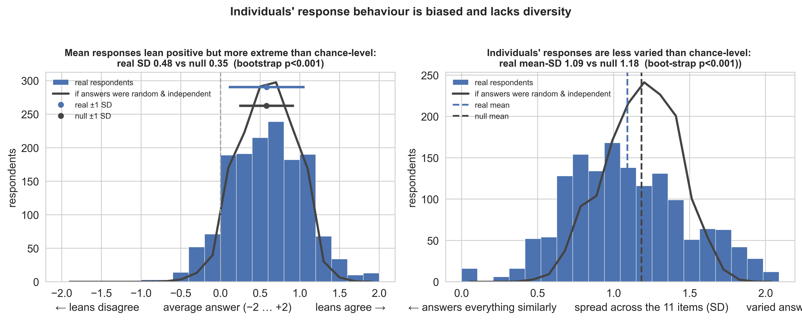
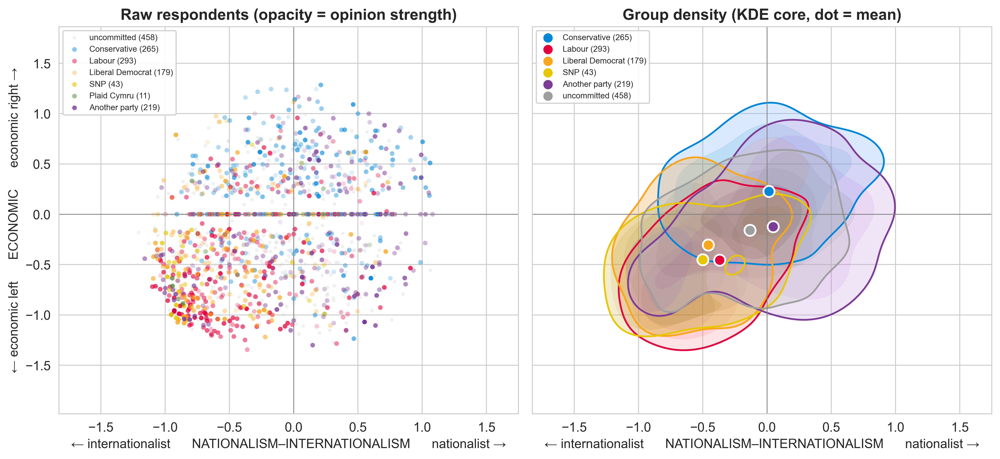
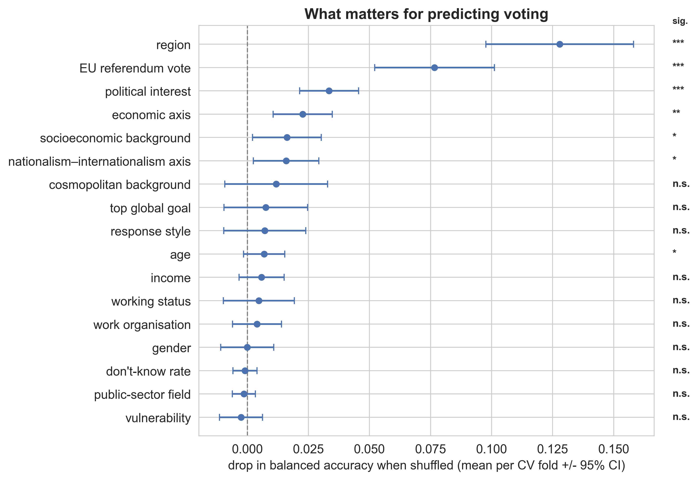

# Predicting UK voting intention - analysis write-up

The goal of this analysis is to predict voting intention in the UK based on survey data. The analysis involves several
steps, including data exploration, cleaning and preprocessing, basic feature engineering, model training, and
evaluation. The following sections outline the key components of the analysis.

## Exploratory data analysis

First, I got an idea of how much data I have, and what the survey item look like.

Each row of the data is one survey respondent, with a total of **1,468 resondents** (post cleaning, see below). The 41
questions fall into a few natural groups:

- **Serial number** - a unique identifier for each respondent (1 question; whole number).
- **Demographics** - age, gender, region, household income, working status, employer type
  (8 questions; categorical, with age also given as an exact number and income as ordered bands).
- **Attitudes** - 11 "do you agree or disagree" statements (e.g. *"there is too much
  reliance on welfare"*, *"the government should prioritise controlling immigration"*),
  each answered on a five-point *strongly disagree → strongly agree* scale (plus "Don't know").
- **Background** - 15 "which of these apply to you" statements (owns
  a second property, has done manual work, has lived abroad, and so on), each a simple
  yes/no (17 questions in total, including the "none of these" and "don't know" options).
- **Political history** - previous voting behaviour in the EU referendum (Remain/Leave) and
  interest in politics (a five-point scale) (2 questions).
- **One priority question** - the single global goal they care about most (1 question; pick one from a list).
- **The target** - which party they'd vote for tomorrow (1 question; one of nine options).

**The target (voting intention) is imbalanced, and a big chunk is uncommitted**. Labour,
Conservative and "another party" lead; the SNP, Plaid Cymru and "rather not say" are
tiny. About **31%** chose "don't know", "would not vote", or "rather not say".

### Cleaning

Before exploring relationships in the data and building a model, I explore the data for issues that might need cleaning.
This includes both errors and choices about how to handle missing or ambiguous data. The table below summarises the main
issues I found, what I did about them, and why.

| What I found                                                             | What I did                                                       | Why                                                                                                                                                                                                                                                                                                                                                     |
|--------------------------------------------------------------------------|------------------------------------------------------------------|---------------------------------------------------------------------------------------------------------------------------------------------------------------------------------------------------------------------------------------------------------------------------------------------------------------------------------------------------------|
| One serial number appeared 32 times with identical rows                  | Dropped 31 duplicates                                            | Apparent data-entry duplication; serial numbers are unique afterwards                                                                                                                                                                                                                                                                                   |
| A "statements apply… don't know" column where **everyone** answered "no" | Removed it                                                       | One value = no information; can't separate voters                                                                                                                                                                                                                                                                                                       |
| Income labels had garbled characters (`ú` instead of `£`)                | Fixed the encoding, then treated income as ordered               | Text artefact from how the file was saved                                                                                                                                                                                                                                                                                                               |
| Two age columns (a band and an exact age) that agree                     | Kept the exact age                                               | Only need one. I decided the continuous scale would be more informative in the model, given the arbritrary splits in the banded age feature.                                                                                                                                                                                                            |
| "Don't know" answers on attitude questions                               | Treated as missing, **not** as a middle value                    | "Don't know" isn't the same as "neither agree nor disagree"; I track each person's don't-know rate separately                                                                                                                                                                                                                                           |
| EU-referendum vote missing for about a quarter of people (~25%)          | Kept the rows, filled blanks as an explicit "No answer" category | The missingness is close to random (only a mild age tilt so not voting eligibility), and it may carry meaning, so I didn't want to drop a quarter of the data. Imputing based off other features would be heavily biased and circular so I chose a simple flagging approach.                                                                            |
| `do_you_work_in` and `owns a second property` over 50% blank             | Same - imputed with "No answer"                                  | I speculate that `do_you_work_in` is a follow-up only asked of people who work in public sector based on the clean split of responses by work organisation; therefore the missing data is again a real state, and keeping this item adds more depth to the model. `owns a second property` is also kept in the interest of minimising information loss. |

### Feature encoding
I also considered the impact of individual response behaviour on the attitudinal questions, given the use of a
subjective agree-disagree scale on these items. I show that respondents generally lean towards agree in their responses,
but also tend to lean more towards the extremes of the scale (strongly agree or strongly disagree) than chance would
predict
(Figure 1). Additionally, respondents are less varied in their responses than chance would predict, in other words, they
tend to answer the same way across multiple questions (Figure 1). To separate this response style from true position
relative to
other respondents, I normalised the attitudinal responses by an individual's responses style. I include oringal mean and
standard deviation of each person's responses in the model, along with a rate of "don't know" responses, to capture the
impact of response style on voting intention.

*Figure 1. Response behaviour on the 11 attitudinal questions. Left: each respondent's mean answer
(−2 disagree … +2 agree); right: the spread (SD) of their answers across the items. In each panel the
grey curve is the null - what we'd expect if everyone answered each item independently at random from
that item's own observed distribution, i.e. with no personal response style. Real respondents depart
from this chance level: their means are spread wider than the null (a lean towards the
extremes) and their SDs sit below it (they answer the items more alike than chance). Bootstrap
p-values quote each effect against the null.*

I also quantify (encode) the ordinal and binary categorical features:
- political interest, mapped to a 0–4 scale (none at all → a great deal);
- household income, mapped to ordered bands (0–12);
- yes/no questions, binarised to 1/0.

Keeping income on an ordinal scale leaves "Prefer not to answer" with nowhere to sit, so those
responses become missing (NaN). This is unfortunately the downside of preserving the ordered
structure and I have to impute with something. I chose median imputation as the least biased fill, 
and add an `income_refused` flag so the
model can still tell which values were imputed.

The same situation arises for the "Don't know" answers on the attitude questions, which also become
NaN (they don't sit on the agree–disagree scale) and are median-imputed. There I capture the
missingness as a per-respondent `dk_rate` rather than a per-item flag.

Remaining categorical features are one-hot encoded to allow initial model exploration including linear regression models.

### Feature engineering
Many of the features in the dataset were correlated to each other. For example, the attitudinal items 
`The_government_should_prioritise_controlling_immigration_over_all_other_policies` and 
`Britain_is_stronger_when_it_forms_partnerships_with_other_countries` (*r*=0.49). 

Anticipating that this inter-correlation would make any model fit hard to interpret, I decided to group the features. I
chose to group them manually: automated approaches like PCA yielded less interpretable groupings, skewed by properties of the
data such as large unanswered contingents. The groups are as follows:

- **Values - the two political axes** (built from 10 of the 11 attitudinal items, sign-corrected so that higher = right/closed, then averaged within respondent):
  - **Economic axis** (left − ↔ right +): *too much reliance on welfare* (+), *tight control over spending should be the main economic priority* (+), *tackling poverty and inequality should be the top priority* (−), *big business takes advantage of ordinary people* (−).
  - **Nationalism–internationalism axis** (internationalist − ↔ nationalist +): *prioritise controlling immigration* (+), *put British people's needs ahead of others* (+), *Britain is the greatest country in the world* (+), *cuts in defence spending leave Britain unable to defend itself* (+), *Britain is stronger forming partnerships with other countries* (−), *the UK should be more outward-looking* (−).
- **Background - life experience / biographical facts** (the 15 "which of these apply to you" items, plus the *I consider myself working class* statement, which I chose to treat as identity rather than a value based on my uncertainty on positioning and low correlation with the other economic (*r*=-.108) and nationalism–internationalism attitudes (*r*=-.016)):
  - **Class position** - working-class self-image, owns more than one property, has done manual labour, earns a living with hands/physical capabilities, earns a living with cognitive/mental capabilities, had a great education growing up, knows how to use Excel, has been made redundant, grew up in a one-parent household.
  - **Cosmopolitan**  - has lived in London, has worked/lived abroad, travels abroad regularly, takes public transport regularly, parents live nearby (rootedness, inverse of mobility).
  - **Vulnerability** - has a health issue/disability affecting work, cares for a child with a serious health issue/disability.
- **Demographics**: age (continuous), gender, region, household income (ordinal + `income_refused` flag), working status, employer type, and `do_you_work_in`.
- **Political background - engagement + prior behaviour:** interest in politics (0–4 scale) and EU-referendum vote (Remain/Leave/No answer).
- **Engagement / response-style - engineered per-respondent summaries**: `opinion_mean` (baseline lean/acquiescence), `opinion_std` (scale usage/extremity), and `dk_rate` (share of attitude items answered "Don't know").
- **Priorities - the single "what do you care about most" choice:** e.g. *climate change*, *healthcare*, *gender equality*, etc.

Only the values are engineered from multiple items; the other groups are simply collections of features to aid model interpretation. 

*Figure 2. Respondents placed on the two engineered value axes - nationalism–internationalism (internationalist ← → nationalist)
on the x-axis, economic (left ↓ ↑ right) on the y-axis - coloured by voting intention. **Left:** every respondent as a
point, with opacity scaled to opinion strength, so faint points are people with weak or
"Don't know" views near the neutral origin. **Right:** the same data as a smoothed density per party (KDE; shaded core =
densest 70% of each group, outline at that boundary) with the filled dot marking each group's mean position. Uncommitted
respondents (don't know / would not vote / rather not say) are pooled in grey; small parties below n=25 (e.g. Plaid Cymru) are omitted from the density panel as too
sparse to estimate reliably. The map shows where each party's supporters concentrate and how much the groups overlap.*

These engineered value features (capturing the two political axes: economic and nationalism–internationalism) are 
moderately able to separate voting intentions alone (Figure 2). The Labour (bottom-left: economic left and 
internationalist/open) and Conservative (upper: economic right and distributed across the nationalism–internationalism axis) 
groups are the most distinct. Lib Dems largely overlap with Labour indicating differences between these groups may
lie more on demographics or other factors, rather than positions on these issues. The voter base for 'other' parties
and the uncommitted contingent predictably lie across the centre of the map. 

Note: the horizontal band at zero on the economic
axis may represent both a true neutral position and a lack of opinion (i.e. "Don't know" responses imputed with the median), or an artefact of 
the engineered feature construction, whereby the two positive and two negative items on the economic axis cancel each other out.
Each point's opacity (alpha) shows how strongly that person holds opinions - bold = firm views, faint = on the fence or 
"Don't know". The band has both: bold points (strong views that pull equally left and right, cancelling to zero) and faint 
ones (genuinely weak opinions), so it is a mix of both explanations.

(*I did also fit a model to the original feature set, which performed slightly worse than using the engineered set of features (cross-validated balanced accuracy across all 9 voting intentions = .336 vs .367).)
(**The groupings themselves were a little arbritrary - some questions could easily have been classified as 'economic' or 'background' (see config.py). 
It's not impossible that this would change my results and interpretation, but I think the groupings are reasonable for a first pass.*)

## Modelling

Next, I fit a model to predict voting intention. Before fitting anything I held
out a stratified 20% test set (294 respondents) and did all model selection and tuning on the training 80%
(1,174 respondents) by cross-validation.

### Choosing a model

I expected a random forest to be a good choice of model: the features are mixed and mostly categorical, and the relationships
to vote are unlikely to be linear.
(Indeed, I found random forest out performed logistic regression on a simple one-hot encoded version of the features 
(cross-validated balanced accuracy .34 vs .31), with a similar F1 score (balance between precision and recall, .31 vs .31).

Therefore, I chose to continue with random forest as my main model.

### Model performance

My final model is a random forest (RF) on the curated feature set - the demographics, life-background, political-background,
the two engineered value axes, the response-style features, and the priority question described above (83 features in
total, with the value axes standing in for the raw attitude items). All the numbers in this subsection are
cross-validated on the training set only (stratified 10-fold).

The model acheived 0.40 cross-validated balanced accuracy. To understand this relative to the 
number of voting outcomes (N=9), I compare against:

- A model which always guesses the largest party (Labour) acheives an accuracy of 0.20; a model guessing in proportion to the class
  frequencies gets 0.15.
- A permutation test (shuffle the labels 100 times and refit) puts chance level at 0.17 ± 0.01; the RF model beat every permtutation of these null controls. 

_NOTES_
* There were too few respondents in some parties (especially Plaid Cymru and "rather not say" categories); these probably should have removed or handled differently (e.g. grouping), as startified CV splits weren't valid for these parties.

### What drives the predictions

To see which features the forest relies on, I used **grouped permutation importance**: I shuffled one group of
columns at a time and measurde the drop in balanced accuracy, where similar survey questions were assigned to the same group 
(see **Feature Engineering** above). The groups that significantly hurt the model when shuffled
(*p* < 0.05), in order, were **region**, **EU-referendum vote**, **political interest**, the **economic** value axis,
**class position** (which includes working-class self-identity, owning more than one party), the **nationalism–internationalism** value axis, and
**age**. No single group of features is exclusively important - the model uses a combination of who people are, how they voted before, how
engaged they are, and where they sit on the value axes to tell the parties apart.

Figure 3 shows this ranked - each block's mean drop in balanced accuracy with a 95% confidence interval across folds.

*Figure 3. Grouped permutation importance (training set): the drop in cross-validated balanced accuracy when each group of columns is
shuffled - its unique contribution given everything else. Points are the mean across 10 cross-validation folds,
whiskers the 95% confidence interval; stars mark a one-sided t-test that the drop exceeds zero (\* p<0.05, \*\* p<0.01,
\*\*\* p<0.001).*

*NOTE*
* Region matters a lot in this model, but less so when SNP - which is a regional party - is excluded.

I explore the distribution of votes across these important features in the interactive dashboard.

### Held-out test performance

Finally, I fit the curated forest on the full training set and scored it once on the held-out 20%. It reached
**0.39 accuracy** and **0.37 balanced accuracy** on unseen data - in line with the cross-validated figures, so the
model isn't over-fitting. 

Per-voting outcome, the model does best on the larger groups, with bootstrapped 95% intervals
of 0.40-0.65 for Labour, 0.38-0.70 for "would not vote", and 0.30-0.58 for the Conservatives. 
It struggles more with don't-knows - who are inherently unsure - acheiving 0.07-0.27, 
and the ver small classes are too unstable to gain reliable outputs. As mentioned above, these small classes should 
probably be grouped or removed in future iterations of the model.

I also looked more closely at *where* the model goes wrong, using the row-normalised confusion matrix (each row is a
true party, showing how its voters are split across the model's predictions). Even when it misclassifies, it tends to
reach for an ideologically similar party. For example, among voters who actually intended to vote Lib Dem, the model
most often predicts Lib Dem (33%) and nearly as often Labour (31%) - an adjacent centre-left party - while a
Conservative prediction is much less likely (14%). Comparatively, among voters who actually intended to vote Labour, 
the model strongly predicts Labour (53%), with other outcomes much less likely (Lib Dem and Would not vote each 12%).

### Exploring the model

The model's outputs are outlined in an interactive dashboard, where
predicted vote shares and the feature relationships above can be explored by group. **[→ Interactive dashboard](#)**
*(link to be added once deployed).*

